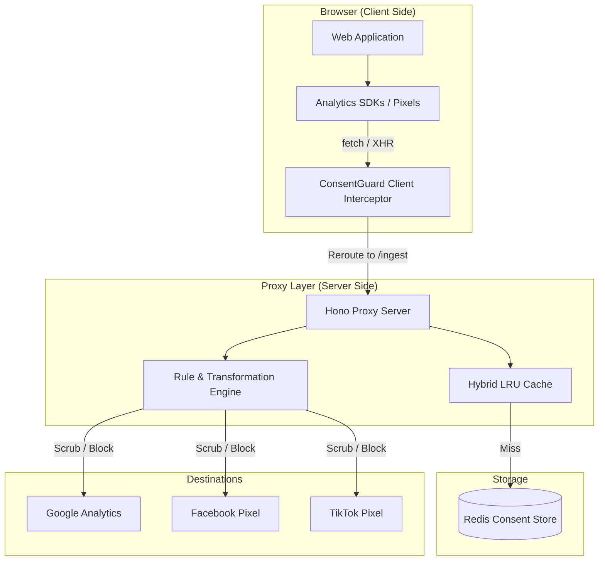

# ConsentGuard Architecture

ConsentGuard is a **dual-mode privacy enforcement layer**. It consists of a client-side interceptor that reroutes traffic and a server-side proxy that enforces privacy policies.

## System Overview

## Key Components

### 1. Client Interceptor (`@consentguard/client`)
- **Primitive Patching**: Overrides `window.fetch`, `XMLHttpRequest`, and `navigator.sendBeacon`.
- **Registry Matching**: Uses a list of known tracking patterns to identify which requests to reroute.
- **Resilience**: Operates with zero external dependencies to ensure it never crashes the host application.

### 2. Hybrid Storage Layer
- **Resilience**: Combines a local in-memory LRU cache with Redis.
- **Performance**: High-traffic consent lookups (<1ms) are handled by the local cache, significantly reducing Redis load.
- **Fail-Closed**: If both layers fail, the system defaults to "deny" for non-essential categories.

### 3. Rule & Transformation Engine
- **Declarative Logic**: Rules are defined as JSON objects specifying paths to `strip`, `hash`, or `redact`.
- **Consent Categories**: Maps every destination to a purpose (e.g., `analytics`, `marketing`).
- **Audit Logs**: Every decision (Forward, Scrub, Block) is logged to Redis for compliance auditing.

### 4. Admin Control Plane
- **Governance**: Allows overriding global rules with tenant-specific policies.
- **Observability**: Provides real-time traffic monitoring and health diagnostics.
- **Replay Buffer**: Temporarily stores events for new users until their consent state is finalized.

## Sequence Flow

1.  **SDK Init**: A tracking SDK (e.g., GA4) initializes and attempts to send a `POST` request to `google-analytics.com`.
2.  **Interception**: The ConsentGuard client catches the request, changes the URL to `proxy.com/ingest/ga4`, and adds authentication headers.
3.  **Authentication**: The proxy validates the `PROXY_SECRET`.
4.  **Consent Lookup**: The proxy checks the `userId` against the Hybrid Cache/Redis.
5.  **Enforcement**: 
    - If **Denied**: Proxy returns `204 No Content` and drops the event.
    - If **Granted**: Proxy applies transformations (e.g., hashing the `user_id`) and forwards the payload to the real GA4 endpoint.
    - If **Pending**: Proxy buffers the request and returns `202 Accepted`.
6.  **Response**: The original SDK receives a successful response, unaware that its data was scrubbed or redirected.
