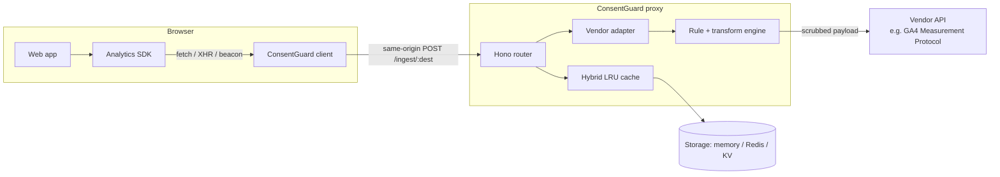

# ConsentGuard Architecture

ConsentGuard is a two-part system: a browser interceptor that reroutes analytics traffic, and a proxy that enforces consent before forwarding it to the real vendor.

## Overview



## Request lifecycle

1. Browser SDK fires a request (e.g. `POST https://www.google-analytics.com/g/collect?...`).
2. The client interceptor recognizes the destination and rewrites the URL to `<proxy>/ingest/ga4`, preserving the original URL in the `X-Original-Url` header.
3. The proxy checks the request's `Origin` against `CG_ALLOWED_ORIGINS` and rejects unknown origins.
4. It resolves the user via `X-Consent-UserId` header, `cuid` cookie, or `?cuid=` query param (in that order).
5. It looks up consent for that user from storage (hybrid cache in front, fail-closed to `deny` on error).
6. It resolves the destination rule (registry defaults, optionally overridden per-tenant in storage).
7. Consent check:
   - **Granted** → run the vendor adapter, apply transformations, forward. Log `forwarded` or `scrubbed`.
   - **Denied** → drop, return `204`. Log `blocked`.
   - **Pending** (no consent record yet) → optionally buffer the request for later replay, return `202`. Log `buffered`.
8. When consent is later saved via `PUT /consent/:userId` or `POST /consent/self`, any buffered requests for that user are replayed in the background.

## Vendor adapters

Each destination has a rule (`id`, `category`, `transformations`) and, if it needs to talk to a real vendor API, an **adapter**. The adapter is responsible for:

- Parsing the intercepted request format (query string for GA4 beacons, JSON body for most others).
- Translating it into the vendor's actual server-to-server API format.
- Providing the upstream URL, method, headers, and body for the `fetch` call.

Today only the **GA4 adapter** is implemented. It maps intercepted `/g/collect` params to Measurement Protocol JSON and posts to `mp/collect` with a server-side `measurement_id` + `api_secret`. Other destinations fall back to a passthrough that forwards the JSON payload as-is — this is a no-op stub, not a working integration.

## Consent state

Stored per user under `consent:<userId>` with a 1-year TTL. Shape:

```json
{
  "userId": "u_abc123",
  "purposes": { "necessary": true, "analytics": true, "marketing": false },
  "timestamp": 1700000000000,
  "metadata": { "source": "self" }
}
```

Consent categories are strings; the current rules use `necessary`, `analytics`, `marketing`, `personalization`. A rule's `category` must be present and `true` in the user's purposes for the request to forward.

## Storage layer

`StorageProvider` interface with three implementations:

- **Memory** — for tests and local sandbox. Data resets on restart.
- **Redis** — via `ioredis`, with a 100ms read timeout.
- **Cloudflare KV** — for edge deployment (Workers runtime).

The **hybrid** provider wraps any of the above with a bounded in-memory LRU cache (default 60s TTL, 1000 entries) and a stale-while-revalidate fallback if the primary store errors.

## Runtimes

The Hono app is runtime-agnostic. Entry points:

- `packages/server/src/index.ts` — Node.js via `@hono/node-server`.
- `packages/server/src/runtime/bun.ts` — Bun.
- `packages/server/src/runtime/workers.ts` — Cloudflare Workers (uses KV storage automatically if `env.CONSENT_STORE` is bound).
- `packages/server/src/middleware/index.ts` — mounts the app as a sub-route in an existing Hono server.

## Audit log

Every ingest decision writes a record to a bounded Redis list (default 1000 entries). The dashboard reads from `GET /audit` and the CLI streams via `consentguard logs`.

## What this doesn't do

- No cross-tenant isolation. One proxy = one tenant.
- No IAB TCF v2 signal reading. If you use a TCF-compliant CMP, wire it into your own banner code that calls `POST /consent/self`.
- No queue-backed retry for failed upstream forwards. If the vendor is down, the event is lost.
- No PII detection beyond what the rules declare. If your app sends an email in an undeclared field, it will forward.
